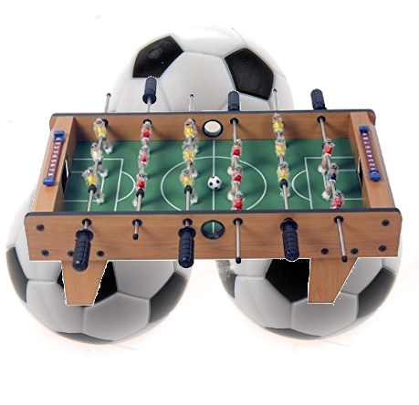
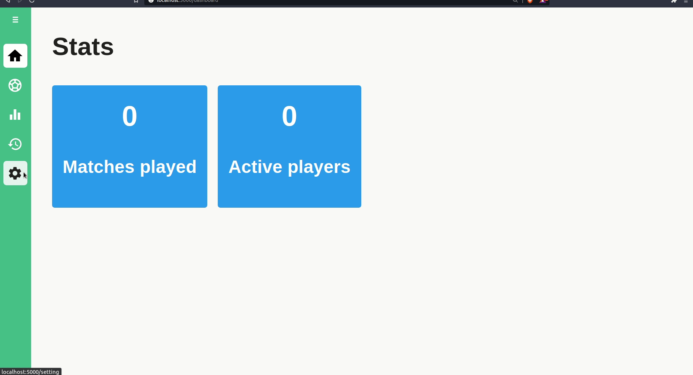

<div align="center">
	
	<h1>FoosBall Game Tracker</h1>
	<p>
		<strong>A foosBall Game Tracker for champions </strong>
	</p>

[]() [](LICENSE)

</div>

<!-- ABOUT THE PROJECT -->
## About The Project



<p>This is a techniacal challenge assignment for a position at </p>
<p><a href="https://www.audacia.co/"> Audacia </a>
Assignment details <a href="./documents/table-football-challenge.pdf">here</a>
</p>

### Features
* API documentation after starting the project visit : http://localhost:3000/docs/#/ (Just some documentation for the sake of this assigment).
* HomePage : - Shows simple data like number of match played / players added.
* Setting page : - Add new players.
* Match page : - Construct teams and start a match.
* Ranking page / sections 1 : - List players match(nb) / Goals(nb) / Points gained, sorted by goals.
* Ranking page / sections 2 : - List teams with Win/lost informations.
* Logs page : - Display list of logs (Teams, Score per team, Team members, start date, Score per player, duration of the game)

## Built With

* Node 12.20.1
* ReactJS
* MySQL
* ExpressJS

## Getting Started

### Prerequisites
* Docker version >= 20.10.3
* docker-compose version >= 1.17.1

### Installation

1. Clone the repo
   ```sh
   git clone https://github.com/abnaceur/foosballtracker.git

2. Copy the environement variables
   ```sh
	cp .env-template .env
	cp client/.env-template client/.env
	cp server/.env-template server/.env
   ```
3. Build the project from the root, get sure that ports 5000/3000/8080 are available
   ```sh
   docker-compose up --build
   ```

4. Once all containers are up visit
   ```SH
   http://localhost:5000 fronend
   http://localhost:8080 PhpMyAdmin
   ```


<!-- ROADMAP -->
## Roadmap

Comming soon ...


<!-- LICENSE -->
## License

Distributed under the MIT License. See `LICENSE` for more information.


<!-- CONTACT -->
## Contact

Abdeljalil NACEUR - contact@naceur-abdeljalil.com


<!-- ACKNOWLEDGEMENTS -->
## Acknowledgements
* ReactJs
* MaterialUI
* Styled-component
